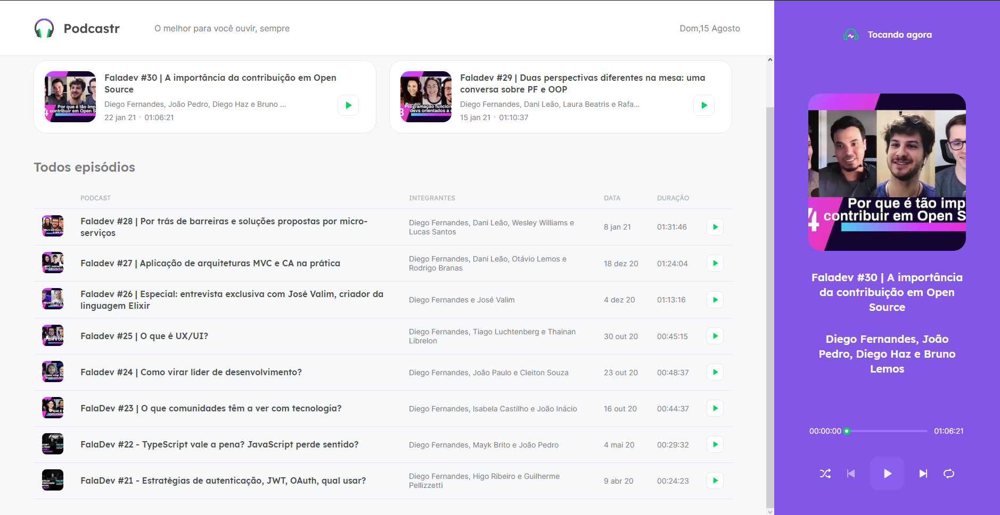

# PodcastrNext

  

Este projeto foi desenvolvido na #05 NLW da [Rocketseat](https://rocketseat.com.br/). 

O projeto é um aplicativo para ouvir os melhores podcast's na melhor qualidade!!

Esse projeto foi desenvolvido com as tecnologias front-end:  
 
ReactJS 
Typescript 
Next.js 

# 💻 Começando o projeto

Requisitos
Você vai precisar instalar o Node.Js e o Yarn para rodar esse projeto.
Clone o meu projeto para acessar os arquivos

$ git clone https://github.com/Chaldow/PodcastrNext.git

Feito isso, siga os próximos passos

# Instale as dependências
$ yarn

# Rode o servidor JSON
$ yarn server

# Rodar o servidor Web
$ yarn dev
 
O aplicativo estará disponível na url: http://localhost:3000

Feito com 💜 por mim: Chaldow 👋 Dê uma olhada no meu LinkedIn.

